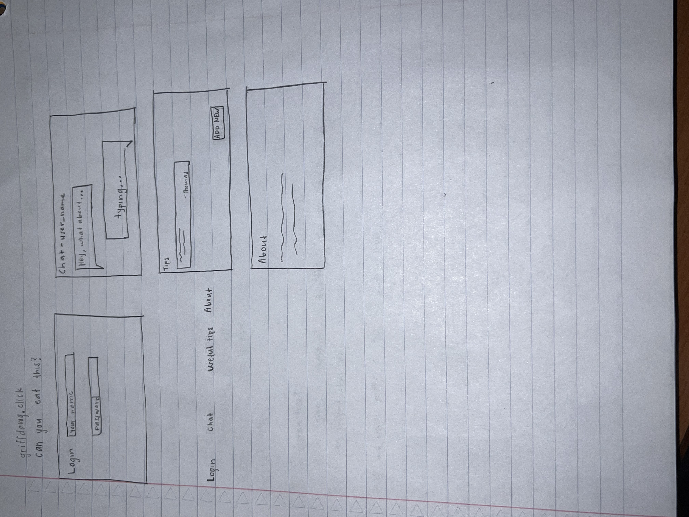

# Gluten-Free Griffdawg

## Description deliverable - Startup Specification

### Elevator pitch

Have you ever been frustrated by your family’s inability to figure out what is and is not gluten-free, or had well-intentioned relatives feed you food that doesn’t agree with your diet, or arrived at a dinner only to find out you cannot eat anything? The Gluten-Free Griffdawg application helps to solve many of these problems. Family can message to ask questions in a chat setting, add tips of what they have learned cooking, and not have to feel so unsure when cooking for someone on a gluten-free diet. Questions in the chat can be answered in realtime, and all members can benefit from each other’s knowledge by adding tips. In a family with gluten-free members, the Gluten-Free Griffdawg app is a must to eliminate the confusion caused by ineffective google searches, and lack of knowledge surrounding what constitutes as gluten-free.

### Design

### Key features

- Secure login over HTTPS
- Messages from all users displayed in realtime
- Ability for a user to submit a tip
- Messages are persistently stored
- Ability for admin to delete bad tips

### Technologies

I am going to use the required technologies in the following ways.

- **DB** - Store users, messages, and tips in database.
- **Login** - Register and login users. Credentials securely stored in database. Can't chat or add tips without authentication.
- **WebSocket** - Peer to peer communication through chatting with friends through the browser, and the ability to submit a tip that is broadcasted for others to see.

